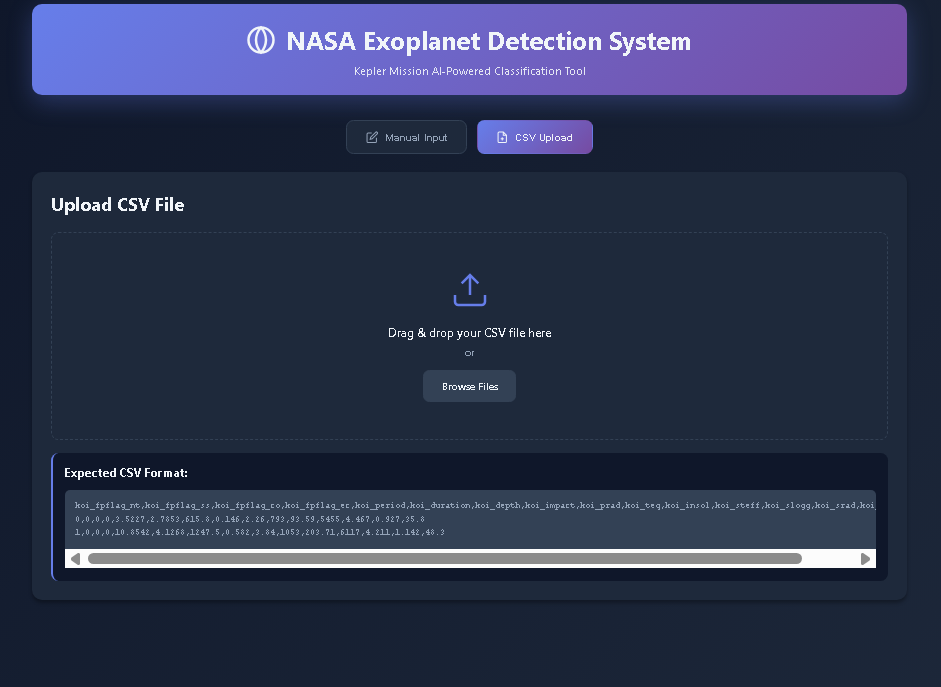

<div align="center">


</div>

# 🪐 NASA Exoplanet Detection System 🌠

This project is a web application designed to predict whether a Kepler Object of Interest (KOI) is a confirmed exoplanet. It provides a user-friendly interface where users can either manually input KOI features or upload a CSV file containing the data. The application then sends this data to a backend API, which processes it and returns a prediction result, displayed to the user. This system aims to simplify exoplanet verification by providing an accessible and efficient prediction tool.

## 🚀 Features

- **Manual Input:** Allows users to enter exoplanet data manually through a form.
- **CSV Upload:** Supports uploading data via CSV files for bulk predictions.
- **Method Switching:** Easily switch between manual input and CSV upload methods.
- **Asynchronous API Calls:** Uses asynchronous JavaScript to communicate with the backend API without blocking the user interface.
- **Loading Indicator:** Provides visual feedback during data processing.
- **Clear Results Display:** Presents prediction results in an easily understandable format.
- **Dynamic UI:** The user interface dynamically adapts based on the selected input method.

### Prerequisites

- A modern web browser (Chrome, Firefox, Safari, etc.)
- Python 3.x (if setting up the Flask backend)
- Flask (if setting up the Flask backend): `pip install flask`

### Installation

1.  **Clone the repository:**

    ```bash
    git clone <https://github.com/alanfrancis765/alanfrancis765.github.io.git>
    ```

2.  **Set up the backend :**

    ```bash
    git clone <https://github.com/alanfrancis765/exoplanet-backend.git>
    pip install -r requirements.txt 
    ```

## 💻 Usage

### Running Locally

1.  **Start the backend server:**

    ```bash
    python app.py  # Or the appropriate command to start the Flask server
    ```

2.  **Open `index.html` in your web browser.**

    Navigate to the project directory and open the `index.html` file with your preferred web browser.

3.  **Interact with the application:**

    -   Choose either manual input or CSV upload.
    -   Enter the required data or upload a CSV file.
    -   Click the submit button to get the prediction results.

## 📂 Project Structure

```
├── index.html
├── static
│   ├── scripts.js
│   └── style.css
exoplanet-backend/
│
├── ML_Model/
│   ├── model_alan.pkl
│   └── train.py
├── app.py
├── requirements.txt
├── README.md
└── LICENSE

```

## 📸 Screenshots




## 📝 License

This project is licensed under the [MIT License].

## 📬 Contact

If you have any questions or suggestions, feel free to contact me at [alanfrancis347@gmail.com](mailto:alanfrancis347@gmail.com).

## 💖 Thanks You

Thank you for checking out the NASA Exoplanet Detection System! We hope this tool is helpful for your exoplanet research and exploration.

